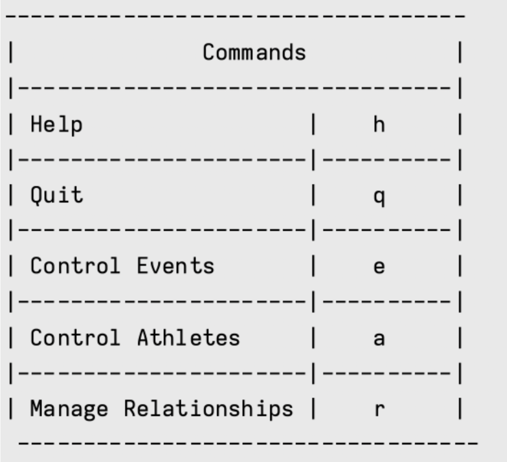
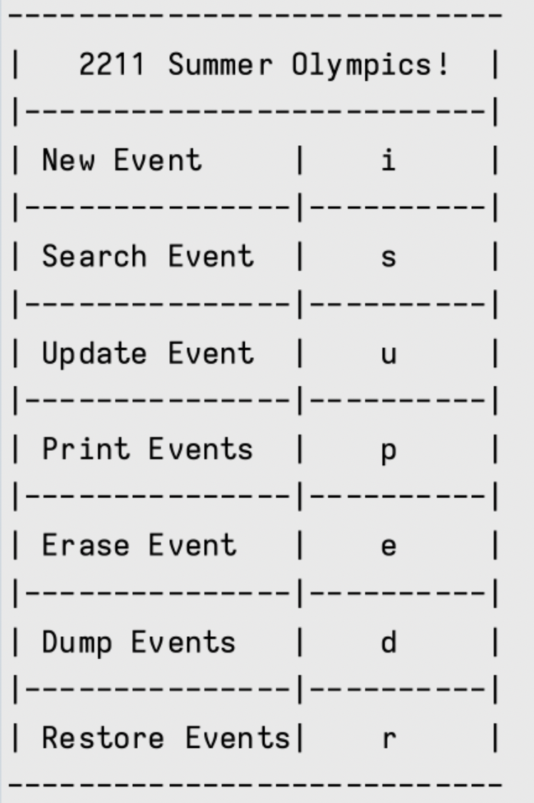
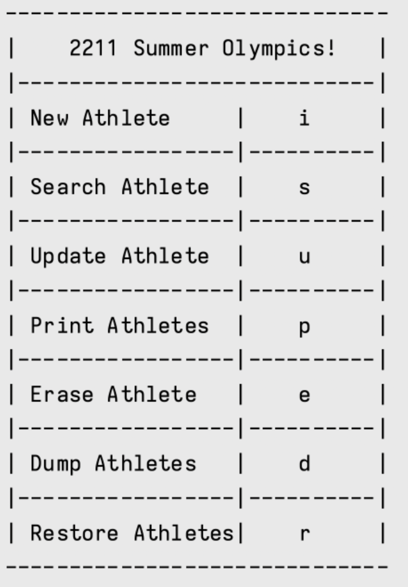
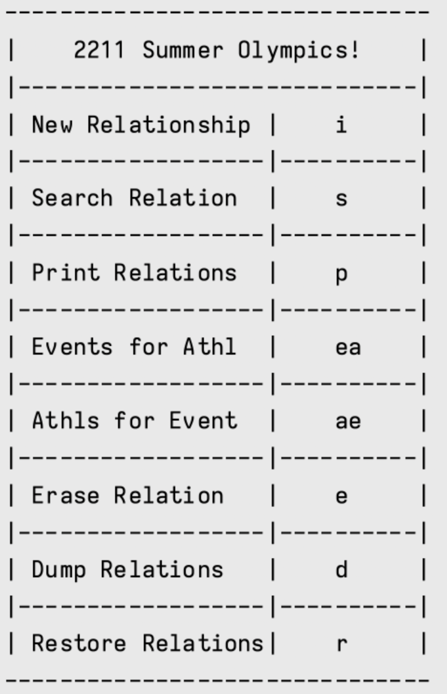

# Summer Olympics Database
The Project aims to simulate a database for an event that holds many different sports and its athletes like in the Olympics or Track and Field events.

# Objective
The purpose of the project is to apply the following concepts from a C-programing language perspective:
- Basic Programming concepts
- Linked List and memory management
- Makefiles
- Program organization

# Database Design
Each event will be stored as a structure with the following attributes.

### Event Attributes

- Event code (eg. 0, 1, 2, 3, 4, etc.). 
    - Each event code is a unique integer
- Event name (eg. "Artistic swimming", "BMX freestyle", "Handball", "Field hockey", etc.)
    - Only sports up to 50 characters in length are acceptable (including the null character)
- Athlete/Team/Competitor count (eg. 10, 11, 12, 13, 14, etc.)
    - Only integers 10-99 are acceptable
- Gender (eg. "Men's", "Women's", and "Mixed" represented in your database as 'M', 'W', and 'X' respectively)
    - Only the characters M, W, and X are acceptable

### Athlete Attributes

- Athlete code (eg. 0, 1, 2, 3, 4, etc.)
    - Each athlete code must be positive and unique. Only integers are acceptable. There is no limit to the number of athletes the database can hold (except memory on the system)
- Athlete name (eg. "John Smith", "Jane Doe", etc.)
    - Only names up to 50 characters in length are acceptable (including the null character)
- Athlete age (eg. 16, 28, 49, 80, etc.)
    - Only integers 14-120 are acceptable
- Athlete nationality represented as a 3 letter code (eg. "CAN", "USA", "MEX", etc.)
    -  Only 3 upper-case letters are acceptable.

### Event-Athlete Attributes
- Event code (eg. 0, 1, 2, 3, 4, etc.)
    - Only event codes that are already found in the database are acceptable
- Athlete code (eg. 0, 1, 2, 3, 4, etc.)
    - Only athlete codes that are already found in the database are acceptable

The Database program will then use a linked list of structures to represent all events, a linked list of structures to represent all athletes and a linked list to represent Event-Athlete Attributes which will form a relationship between event and athletes.

# Implementation
The program will continously prompt the user for one of four possible commands

- Print help
    - command _h_ 
- Quit
    - command _q_
- Control events
    - command _e_
- Control athletes
    - command _a_
- Manage Relationships
    - command _r_

When the command _e_ is executed in the terminal the following implementation for events occurs

### Events

1.	Insert a new event (using command i)
    - Prompt the user for the event code
        - This must be unique in your database and cannot conflict with an existing event code. 
        - If there is a conflict with an existing code, or if the database is full (you cannot allocate any more memory), tell the user the error. The user can try again or you can return the user to the main prompt.
    - Prompt the user for the name of the event
        - If the event name is longer than the acceptable length, the program will accept as many characters as it was implemented and should ignore any additional characters. 
        - If there is any other issue, tell the user the error. The user can try again or you can return the user to the main prompt.
    - Prompt the user for the number of competitors in this event
        - If the number is less than 10 or greater than 99, the program tells the user the error.
    - Prompt the user for the gender of the event
        - If a value other than M, W, and X is entered, the program tells the user the error.

2. Search for an event in the database and print it out (using command s)
    - Prompt the user for the event code
        - If the event code is found, the program prints out all the values for this event only (see the print command below for more details)
        - If the event code is not found, the program tells the user the error.

3. Update an event in the database (using command u)
    - Prompt the user for the event code
        - If the event code is found, the program prompts the user to update all the values for the event (see the insert command above for details)
        - If the event code is not found, the program tells the user the error.

4. Print the entire list of events (using command p)
    - Print out a table listing all the events in your database with all the attributes:
        - Event Code
        - Event Name
        - Competitors
        - Gender

5. Erase event (using command e)
    - Prompt the user for the event code
        - If the event code is found, the program will delete the event safely by removing the element from the linked list and freeing the memory
        - If the event code is not found, the program tells the user the error.

6. Dump the database (Command d)
    - writes all the nodes in the database to a file

7. Restore the database (Command r)
    - reads all the nodes in the file and adds them back to the database

When the command _a_ is executed in the terminal the following implementation for events occurs

### Athletes

1.	Insert a new athlete (using command i)
    - Prompt the user for the athlete code
        - This must be a unique integer in the database and cannot conflict with an existing event athlete code. 
        - If there is a conflict with an existing code, or if the database is full (cannot allocate any more memory), the program tells the user the error.
    - Prompt the user for the name of the athlete
        - If the athlete name is longer than the acceptable length, the program accepts as many characters as it can and ignores any additional characters. 
        - If there is any other issue, the program tells the user the error. 
    - Prompt the user for the age of the athlete
        - If the number is less than 14 or greater than 120, the program tells the user the error 
    - Prompt the user for the nationality of the athlete
        - If the nationality code is longer than the acceptable length, the program accepst only the first three characters and ignore any additional characters. 
        - The program verifies the string received is actually a valid three letter nationality code. 
        - If there is any other issue, the program tells the user the error.

2. Search for an athlete in the database and print it out (using command s)
    - Prompt the user for the athlete code
        - If the athlete code is found, print out all the values for this athlete only (see the print command below for more details)
        - If the athlete code is not found, the program tells the user the error.
3. Update an athlete in the database (using command u)
    - Prompt the user for the athlete code
        - If the athlete code is found, prompt the user to update all the values for the athlete (see the insert command above for details)
        - If the athlete code is not found, the program tells the user the error.
4. Print the entire list of athletes (using command p)
    - Print out a table listing all the athletes in your database with all the attributes:
        - Athlete Code
        - Athlete Name
        - Athlete Age
        - Athlete Nationality
5. Erase athlete (using command e)
    - Prompt the user for the athlete code
        - If the athlete code is found, the program erases the athlete safely by removing the element from the linked list and freeing the memory
        - If the athlete code is not found, the program tells the user the error.

6. Dump the database (Command d)
    - writes all the nodes in the database to a file

7. Restore the database (Command r)
    - reads all the nodes in the file and adds them back to the database

When the command _r_ is executed in the terminal the following implementation for events occurs

### Event-Athlete Relationships

1. Insert a new event/athlete relationship (Command i)
    - Due to referential integrity, the event code entered by the user **must already exist** as a valid event in the database. In other words, an athlete cannot be a member of an event which doesn't exist yet.
    - Due to referential integrity, the athlete code entered by the user **must already exist** as a valid athlete in the database. In other words, an event cannot have an athlete which doesn't exist yet.

2. Search for event/athlete relationship (Command s)
    - Prompt the user for a relationship code. 
    - Print out the event and athlete codes on that relationship

3. Print all (Command p)
    - Print all relationships in your database and the associated event and athlete codes

4. Print all events for an athlete (Command ea)
    - Prompt the user for an athlete id, print out all the event attributes for this athlete

5. Print all athletes for an event (Command ae)
    - Prompt the user for an event id, print out all the athlete attributes for this event

6. Remove an existing event/athlete relationship (Command e)

7. Dump the database (Command d)
    - writes all the nodes in the database to a file

8. Restore the database (Command r)
    - reads all the nodes in the file and adds them back to the database

9. Additional Constrains
    - Due to referential integrity, its not be possible to remove an event after an event/athlete relationship is created. 
    - Its also not possible to remove an athlete after an event/athlete relationship is created. 
    - The user must first remove all relationships, then they can remove the event or the athlete.
